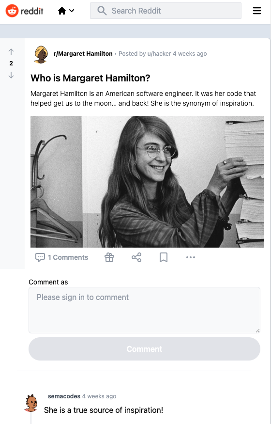

# Reddit 2.0
Welcome to Reddit 2.0! [You can access the game by clicking here.](https://reddit-2-0-eta.vercel.app/) Reddit is a website where users can share links, images, and text-based content and discuss and vote on that content. In addition, Reddit 2.0 is home to various communities (known as "subreddits") dedicated to topics ranging from news and politics to hobbies and entertainment.

 

## Tech Stack
Reddit 2.0 is built using ReactJS, NextJS, NextAuth, TypeScript, Tailwind CSS, Supabase, GraphQL, and Vercel. 

## Getting Started
To get started with Reddit 2.0, visit https://reddit-2-0-eta.vercel.app in your web browser. You do not need to create an account to use this application; however, you will need a Reddit account to create content. 

## Features
Reddit 2.0 provides users with several features to enhance their Reddit experience.

### 1. Creating subreddits and posting content
Once you've created your account, you can start contributing content. To post Reddit content, click "Create a post by entering a title!". Adding a title and body can create or contribute to an existing subreddit.

### 2. Adding images
If you prefer adding visual content to your post, click on the image icon on the right top and enter the URL of your image!

### 3. Browse subreddits
Users can easily browse their favorite subreddits by selecting from the top communities listed on the homepage.

### 4. View posts and comments
Users can view posts and comments within a subreddit by clicking the post title. 

### 5. Sign in to Reddit 2.0
Users can sign in to their Reddit 2.0 account to access features such as upvoting, downvoting, and commenting on posting. To sign in, click the "Sign In" button in the top right corner of the application and enter your Reddit username and password.

### 6. Responsive design
Reddit 2.0 is designed to be responsive and mobile-friendly, allowing users to browse Reddit from their smartphones and tablets.

## Support
If you encounter any issues while using Reddit 2.0 or have suggestions for improving the application, please get in touch with the developer. 

## Conclusion
We hope that Reddit 2.0 provides you with an enhanced Reddit experience. Whether browsing your favorite subreddits or engaging in discussions with other users, we're confident that our application will provide you with a streamlined and modernized experience.